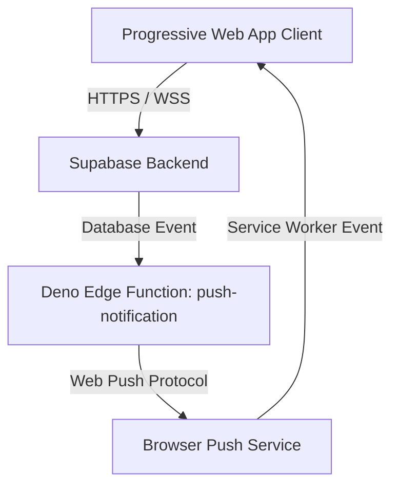

# HelpHive Version 2 - Pan India Launch Documentation

This document describes the architectural changes, database schemas, security configurations, and feature updates introduced in HelpHive Version 2 (Pan India Launch).

---

## 🏗 System Architecture

HelpHive V2 evolves the platform from a localized MVP to a scalable, production-grade service capable of handling high-volume, location-aware matching, real-time push notifications, and administrative analytics across multiple regions in India.



---

## 1. Geographic Location & Addresses System

HelpHive V2 transitions from text-based coordinates to a precise PostGIS GIS-based location system to support hyperlocal capabilities.

### Database Table: `user_addresses`
Stores user-saved locations using PostGIS geography points for highly accurate distance queries.

```sql
CREATE TABLE public.user_addresses (
    id UUID PRIMARY KEY DEFAULT gen_random_uuid(),
    user_id UUID REFERENCES public.profiles(id) ON DELETE CASCADE,
    label VARCHAR(50), -- e.g., 'Home', 'Office'
    formatted_address TEXT NOT NULL,
    landmark VARCHAR(255),
    coordinates GEOGRAPHY(POINT) NOT NULL, -- PostGIS geography type
    is_default BOOLEAN DEFAULT false,
    last_used_at TIMESTAMPTZ DEFAULT now(),
    created_at TIMESTAMPTZ DEFAULT now()
);
```

### RLS Policies
- **Select**: Users can only view their own saved addresses.
- **Insert/Update/Delete**: Restrained to the address owner (`auth.uid() = user_id`).

---

## 2. Dispatcher Queue & Matching Engine

The core matching algorithm is now location-critical and category-aware, running entirely within Supabase PL/pgSQL database functions and triggers.

### Key Components:
- **Dispatcher Queue (`job_offers`)**: Manages the matching state machine for taskers selected for specific jobs.
- **Standardized Radii**: Category-specific matching radii to prevent unnecessary notifications.
  - *Errands & Deliveries / Moving*: Hyperlocal matching within $5\text{ km}$.
  - *Creative / Events*: Broader matching up to $15\text{ km}$.
- **Dispatcher Logic (`backend_dispatch.sql`)**: 
  - Finds the closest active Taskers who have the required skill.
  - Automatically handles matching transitions: `searching` $\rightarrow$ `accepted` $\rightarrow$ `in_progress` $\rightarrow$ `completed`.

---

## 3. Secure Waitlists

To manage scaling during the Pan India roll-out, a Waitlist system is implemented to control user onboarding and prevent spam.

- **Spam Prevention**: Rate-limiting and validation triggers on waitlist signups.
- **Priority Scoring**: Custom onboarding status logic prioritizing high-demand regions and categories.

---

## 4. Admin Analytics Dashboard

A high-performance analytics reporting module that computes system health metrics on the fly using materialized views and indexes.

- **Fulfillment Rate**: Ratio of completed jobs to total jobs.
- **Average Match Time**: Time delta from job creation to Tasker acceptance.
- **Active Tasker Densities**: Geographical grouping of active Taskers to locate supply shortages.

---

## 5. PWA (Progressive Web App) & Push Notifications

HelpHive V2 is a fully-supported Progressive Web App (PWA) with offline caching and native-like web push notifications.

### Service Worker (`src/sw.js`)
Built via the Vite PWA Plugin using an `injectManifest` strategy:
- **Precaching**: Caches static assets (HTML, JS, CSS, images) for offline capabilities.
- **Background Push Handler**: Listens to standard W3C Web Push events, rendering native-looking notifications and opening action-specific URLs upon click.

### Push Notification Edge Function (`supabase/functions/push-notification`)
A Deno-based Supabase Edge Function that leverages the `web-push` library to deliver notifications to subscribed devices.
- **Security Best Practice**: The sensitive VAPID private key is loaded securely via Deno environment variables (`VAPID_PRIVATE_KEY`) instead of being hardcoded in code.

---

## 🛡 Security & Best Practices

1. **No Hardcoded Secrets**: All backend secrets (Supabase Service Role Key, VAPID Private Key) are managed through Supabase Secret Store/Deno Env. Frontend secrets (Supabase Anon Key) are loaded via Vite's environment compilation.
2. **Postgres Row Level Security (RLS)**: Strictly enforced on all database tables. Public write access is denied.
3. **Database Indexing**: Hyperlocal queries are optimized using GiST indexes on geography columns (`coordinates`) to ensure sub-millisecond response times at scale.
